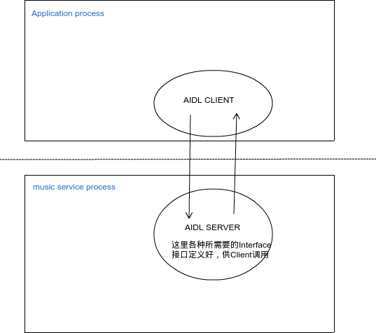

共享Media Service
---



共享Media Service就是做到appA与appB...都可以控制播放器，不再是一个人的播放器，想要的信息都可以有方法获取，aidl是个不错的选择

后台音乐播放其实就是要做到后台播放，这里我们最不希望的就是有有关UI相关的控制了，干脆用DIAL是个不错选择

你启动我就好，有变更消息我都广播给你，其他你自己主动来拿

**aidl**推荐[gityuan相关文章系列](http://gityuan.com/2015/11/23/binder-aidl/)

## 参考：

android系统Music APK

License
---

```
Copyright 2016 xuie0000

Licensed under the Apache License, Version 2.0 (the "License");
you may not use this file except in compliance with the License.
You may obtain a copy of the License at

   http://www.apache.org/licenses/LICENSE-2.0

Unless required by applicable law or agreed to in writing, software
distributed under the License is distributed on an "AS IS" BASIS,
WITHOUT WARRANTIES OR CONDITIONS OF ANY KIND, either express or implied.
See the License for the specific language governing permissions and
limitations under the License.
```